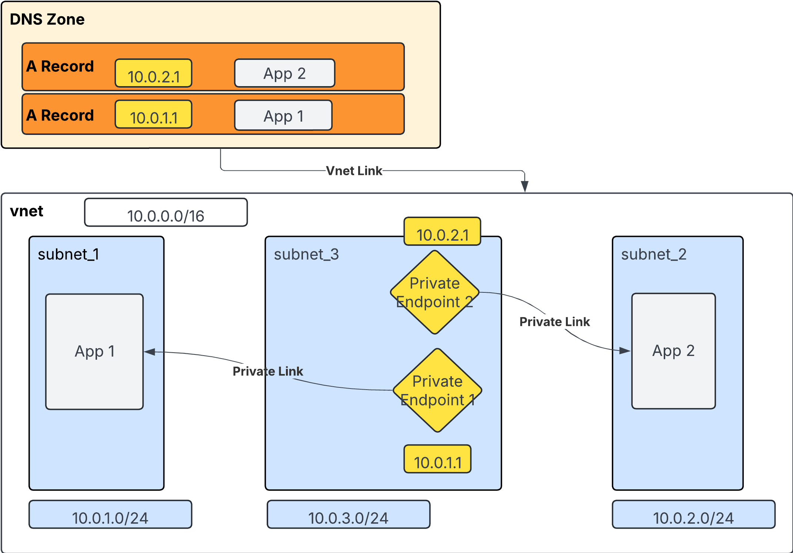

# Private_DNS_Terraform
This repo showcases a simple example on how to set-up a private DNS Zone in Azure using Terraform Code.

You need to add a folder vars and add the tfvars file in there.

Here's what we are building.


Potential improvement is to use modules


Navigate to the repo and run:
- terraform init
- terraform plan -var-file="vars/values.tfvars"
- terraform apply -auto-approve -var-file="vars/values.tfvars" 
- terraform destroy -var-file="vars/values.tfvars"

For testing:
- navigate to the src repo, to Application_1 and replace xxxx with the dns-app2 Function App Key (found in Azure)
```
https://dns-app2.azurewebsites.net/api/ReceiveCall?code=xxxx"
```

Or publish directly in Visual Studio

Call app

```
curl -o response.html https://dns-app2.azurewebsites.net
curl -w "\nHTTP Status Code: %{http_code}\n" -o response.html https://dns-app2.azurewebsites.net && cat response.html

 tracert -d dns-app2.azurewebsites.net

```

