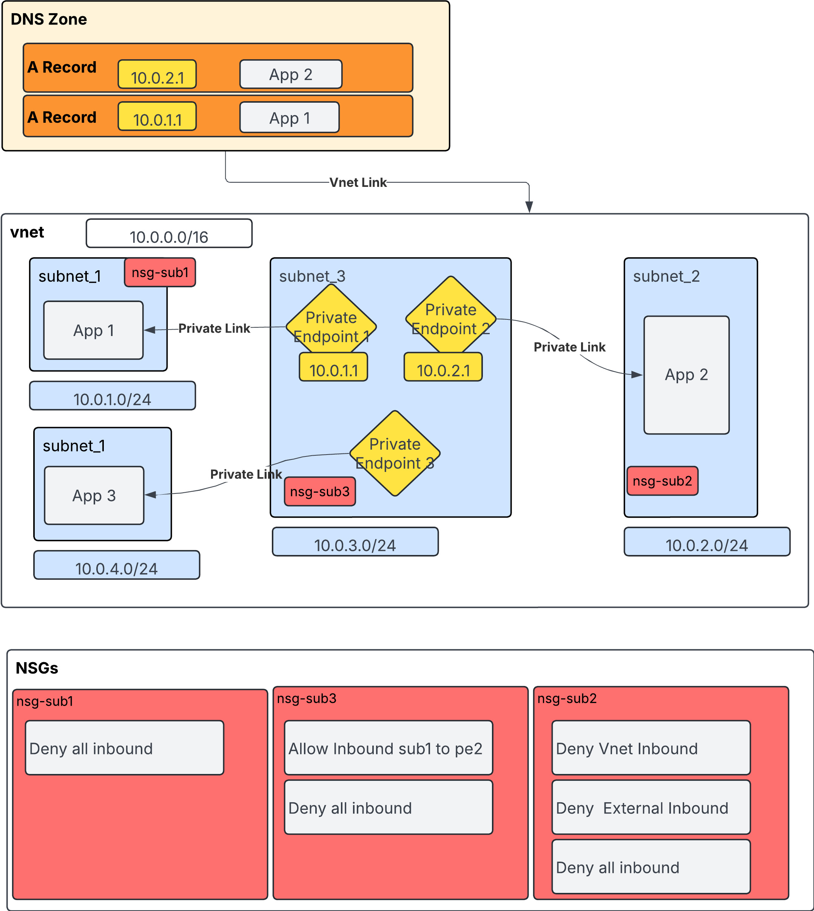

# Private_DNS_Terraform
This repo showcases a simple example on how to set-up a private DNS Zone in Azure using Terraform Code.

You need to add a folder vars and add the tfvars file in there.

Here's what we are building.


Potential improvement is to use modules


Navigate to the repo and run:
- terraform init
- terraform plan -var-file="vars/values.tfvars"
- terraform apply -auto-approve -var-file="vars/values.tfvars" 
- terraform destroy -var-file="vars/values.tfvars"

For testing:
- navigate to the app repo and run
```
cd FunctionApp1  
func azure functionapp publish dns-app2

```

